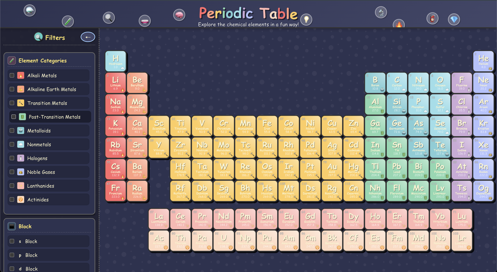

# Periodic Table Visualizer

An interactive, colorful, and educational periodic table of elements built with React and TypeScript.



## 🏆 Hackathon Project

This project was developed for the [CodeCircuit.ai](https://www.codecircuit.ai/) hackathon, based on the prompt:

> "Periodic table with hover info and filter by properties."

The goal was to create an engaging, functional web application that makes exploring the periodic table fun and educational while demonstrating clean code and thoughtful UI/UX design.

## 🧪 Overview

This application provides a fun and engaging way to explore the chemical elements. With a cartoonish design and intuitive interface, it makes learning about the periodic table enjoyable for students, educators, and science enthusiasts.

## ✨ Features

- **Complete Periodic Table**: All 118 elements with accurate scientific data
- **Interactive Elements**: Hover over elements to view detailed information
- **Advanced Filtering System**: Filter elements by:
  - Category (Alkali Metals, Noble Gases, etc.)
  - Block (s, p, d, f)
  - Period (1-7)
  - Physical State (Solid, Liquid, Gas)
  - Natural vs. Synthetic Elements
  - Atomic Mass Range
  - Discovery Period (Ancient, Pre-1800, 1800s, 1900s, Modern Era)
- **Responsive Design**: Optimized for desktop and mobile landscape modes
- **Orientation Helper**: Smart detection prompts users to rotate to landscape mode on mobile
- **Dark Mode Support**: Automatically switches based on system preferences
- **Interactive Tooltips**: Quick information on hover
- **Detailed Element View**: Comprehensive information panel for each element

## 🎨 Theme & Design

The application features a playful, cartoonish design with:
- Vibrant color coding for different element categories
- Fun emoji representations for each element type
- Animated UI elements for a lively experience
- Comic-style typography and visual elements
- Responsive layout that works on various screen sizes

## 👥 Target Audience

- **Students**: Middle school to college students studying chemistry
- **Educators**: Teachers looking for interactive tools to explain the periodic table
- **Science Enthusiasts**: Anyone interested in chemistry and the elements
- **Visual Learners**: People who benefit from visual and interactive educational content

## 🚀 Getting Started

1. Clone the repository
2. Install dependencies:
   ```
   npm install
   ```
3. Start the development server:
   ```
   npm run dev
   ```
4. Build for production:
   ```
   npm run build
   ```

## 💻 Technologies Used

- **React**: UI library
- **TypeScript**: Type-safe JavaScript
- **Vite**: Build tool and development server
- **CSS**: Custom styling without external UI libraries
- **React-Tooltip**: For interactive tooltips

## 📝 License

MIT

---

Made with ⚗️ and 🔬 for the love of chemistry!

*Submitted as an entry to the CodeCircuit.ai Hackathon, 2025*
